# Cloud Monitored RAG

Cloud Monitored RAG is a secure, observable Retrieval-Augmented Generation (RAG) application for asking grounded questions about enterprise PDF knowledge bases. It is designed to demonstrate the controls enterprises expect when an application depends on external AI and retrieval services:

- Prompt-injection filtering before retrieval and generation.
- Hybrid retrieval combining dense vector similarity and sparse BM25 keyword matching.
- Grounded Gemini answers using retrieved source passages.
- Retrieval-quality signals, latency instrumentation, and token telemetry.
- Local Phoenix observability for development and evidence capture.
- A Streamlit application for chat, retrieval inspection, guardrail testing, and telemetry.
- Flask APIs suitable for Cloud Run deployment.

## Features

### PDF ingestion

- Reads PDF files only.
- Uses `pypdf` for text extraction.
- Does not perform OCR.
- Normalizes extracted text.
- Splits text into configurable overlapping chunks.
- Default chunk size: 800 characters.
- Default overlap: 80 characters.
- Generates local 384-dimensional embeddings with `sentence-transformers/all-MiniLM-L6-v2`.
- Uses deterministic UUIDs so rerunning ingestion is repeatable.
- Stores text, source filename, chunk ID, and vectors in Weaviate.

### Weaviate vector database

- Connects to Weaviate Cloud using an API key from environment variables.
- Creates the `KnowledgeChunk` collection when needed.
- Uses Weaviate's HFresh vector index for clusters that enforce that index type.
- Stores self-provided vectors generated locally.
- Supports hybrid retrieval through Weaviate's `collection.query.hybrid()` API.
- Combines semantic vector search with BM25 keyword matching.
- Configurable `HYBRID_ALPHA` controls the dense/sparse balance.

### Security guardrails

The shared `sanitize_user_query()` wrapper runs before retrieval and generation. It rejects:

- “Ignore previous instructions” attempts.
- “Disregard prior instructions” attempts.
- System/developer message overrides.
- System prompt extraction requests.
- Safety bypass attempts.
- Secret, credential, and API-key extraction attempts.
- Empty queries.
- Queries longer than 4,000 characters.

Rejected queries return the reason and matched markers. The same function is used by the direct agent, Flask API, Streamlit chat tab, and guardrail test tab.

Retrieved PDF text is passed as untrusted context. Instructions inside documents are not treated as application instructions.

### Grounded generation

- Uses Gemini 2.5 Flash through Vertex AI.
- Answers using retrieved context only.
- Requests direct answers with source citations.
- Limits generation temperature for repeatability.
- Adds a source-coverage safeguard when the model produces an answer that is shorter than the relevant policy passage.
- Returns a “not found” response when no supporting chunks are available.

### Observability and evaluation

OpenTelemetry spans are emitted for:

- `rag.run`
- `rag.retrieval`
- `rag.generation`

Captured attributes can include:

- Query length.
- Number of retrieved chunks.
- Retrieval hit rate.
- Model name.
- Vertex input token count.
- Vertex output token count.
- Vertex total token count.

The `retrieval_hit_rate()` signal measures the fraction of returned hits with a positive hybrid score. It is attached to the parent RAG span and is visible in Phoenix when spans are exported successfully.

## Screenshots of project traces and dashboards:

# Weaviate Cloud


# Phoenix - Traces and evaluation metrics


# Streamlit - Chat, Retrieval Inspector, Guardrail Test and Telemetry


### User interfaces and APIs

The Streamlit interface includes:

- Chat tab for grounded questions.
- Retrieval inspector for ranked hybrid-search results.
- Guardrail test tab showing accepted/rejected status and markers.
- Telemetry tab showing Phoenix status, project, and trace instructions.
- Sidebar onboarding documentation and current configuration.

The Flask API includes:

- `GET /health`
- `POST /query`
- JSON validation.
- Guardrail status and matched markers.
- Retrieved results and hit-rate output.
- HTTP `422` for rejected prompt-injection queries.

## Architecture Flow Diagram

```mermaid
%% Generated by https://gitdiagram.com/harshithada/cloud_monitoredrag
flowchart TD

subgraph group_interfaces["User interfaces"]
  node_streamlit["Streamlit console<br/>[streamlit_app.py]"]
  node_flask_api["Flask query API<br/>[api.py]"]
end

subgraph group_query["Guarded RAG"]
  node_agent["RAG agent"]
  node_guardrail["Query guardrail<br/>[rag_pipeline.py]"]
  node_retrieval["Hybrid retrieval<br/>[rag_pipeline.py]"]
  node_query_embedding["Query embedding<br/>[rag_pipeline.py]"]
  node_weaviate[("Weaviate collection<br/>[rag_pipeline.py]")]
  node_generation["Grounded generation<br/>[rag_pipeline.py]"]
  node_coverage["Source coverage<br/>[rag_pipeline.py]"]
  node_answer["Cited answer"]
end

subgraph group_ingestion["PDF ingestion"]
  node_ingest_api["Ingestion endpoint"]
  node_ingestion["PDF ingestion"]
  node_extraction["PDF extraction<br/>[rag_pipeline.py]"]
  node_chunking["Text chunking<br/>[rag_pipeline.py]"]
  node_document_embedding["Document embeddings<br/>[rag_pipeline.py]"]
end

subgraph group_observability["Observability"]
  node_telemetry["OpenTelemetry spans"]
  node_phoenix["Phoenix dashboard<br/>[Server_Phoenix.py]"]
end

node_user(("User"))
node_vertex{{"Vertex Gemini"}}
node_pdfs["Authorized PDFs"]
node_otlp{{"OTLP collector"}}

node_user -->|"asks via"| node_streamlit
node_user -->|"queries via"| node_flask_api
node_streamlit -->|"submits chat"| node_agent
node_streamlit -->|"inspects results"| node_retrieval
node_streamlit -->|"tests query"| node_guardrail
node_flask_api -->|"dispatches query"| node_agent
node_agent -->|"checks input"| node_guardrail
node_agent -->|"searches accepted query"| node_retrieval
node_agent -->|"requests answer"| node_generation
node_retrieval -->|"encodes query"| node_query_embedding
node_retrieval -->|"runs hybrid search"| node_weaviate
node_weaviate -->|"returns ranked chunks"| node_retrieval
node_generation -->|"generates with"| node_vertex
node_generation -->|"checks answer"| node_coverage
node_coverage -->|"returns cited result"| node_answer
node_ingest_api -->|"invokes directory ingest"| node_ingestion
node_pdfs -->|"supplies documents"| node_ingestion
node_ingestion -->|"extracts text"| node_extraction
node_ingestion -->|"splits text"| node_chunking
node_ingestion -->|"embeds chunks"| node_document_embedding
node_ingestion -->|"upserts chunks"| node_weaviate
node_agent -->|"creates run spans"| node_telemetry
node_retrieval -->|"records retrieval"| node_telemetry
node_generation -->|"records generation"| node_telemetry
node_telemetry -->|"exports spans"| node_otlp
node_otlp -->|"feeds dashboard"| node_phoenix

click node_streamlit "https://github.com/harshithada/cloud_monitoredrag/blob/main/streamlit_app.py"
click node_flask_api "https://github.com/harshithada/cloud_monitoredrag/blob/main/api.py"
click node_agent "https://github.com/harshithada/cloud_monitoredrag/blob/main/RAG_Agent_VertexAI_GoogleADK.py"
click node_guardrail "https://github.com/harshithada/cloud_monitoredrag/blob/main/rag_pipeline.py"
click node_retrieval "https://github.com/harshithada/cloud_monitoredrag/blob/main/rag_pipeline.py"
click node_query_embedding "https://github.com/harshithada/cloud_monitoredrag/blob/main/rag_pipeline.py"
click node_weaviate "https://github.com/harshithada/cloud_monitoredrag/blob/main/rag_pipeline.py"
click node_generation "https://github.com/harshithada/cloud_monitoredrag/blob/main/rag_pipeline.py"
click node_coverage "https://github.com/harshithada/cloud_monitoredrag/blob/main/rag_pipeline.py"
click node_ingest_api "https://github.com/harshithada/cloud_monitoredrag/blob/main/ingestion_service.py"
click node_ingestion "https://github.com/harshithada/cloud_monitoredrag/blob/main/ingestion_weaviate.py"
click node_extraction "https://github.com/harshithada/cloud_monitoredrag/blob/main/rag_pipeline.py"
click node_chunking "https://github.com/harshithada/cloud_monitoredrag/blob/main/rag_pipeline.py"
click node_document_embedding "https://github.com/harshithada/cloud_monitoredrag/blob/main/rag_pipeline.py"
click node_telemetry "https://github.com/harshithada/cloud_monitoredrag/blob/main/Observability_Traces_Phoenix.py"
click node_phoenix "https://github.com/harshithada/cloud_monitoredrag/blob/main/Server_Phoenix.py"

classDef toneNeutral fill:#f8fafc,stroke:#334155,stroke-width:1.5px,color:#0f172a
classDef toneBlue fill:#dbeafe,stroke:#2563eb,stroke-width:1.5px,color:#172554
classDef toneAmber fill:#fef3c7,stroke:#d97706,stroke-width:1.5px,color:#78350f
classDef toneMint fill:#dcfce7,stroke:#16a34a,stroke-width:1.5px,color:#14532d
classDef toneRose fill:#ffe4e6,stroke:#e11d48,stroke-width:1.5px,color:#881337
classDef toneIndigo fill:#e0e7ff,stroke:#4f46e5,stroke-width:1.5px,color:#312e81
classDef toneTeal fill:#ccfbf1,stroke:#0f766e,stroke-width:1.5px,color:#134e4a
class node_streamlit,node_flask_api,node_user toneBlue
class node_agent,node_guardrail,node_retrieval,node_query_embedding,node_weaviate,node_generation,node_coverage,node_answer toneAmber
class node_ingest_api,node_ingestion,node_extraction,node_chunking,node_document_embedding toneMint
class node_telemetry,node_phoenix toneRose
class node_vertex,node_pdfs,node_otlp toneIndigo
```


## Data flow

### Ingestion

1. Place authorized, text-based PDFs in `docs/`.
2. `ingestion_weaviate.py` extracts text with `pypdf`.
3. Text is normalized and split into 800-character chunks with 80-character overlap.
4. `sentence-transformers/all-MiniLM-L6-v2` creates 384-dimensional local embeddings.
5. Chunks, source filenames, chunk IDs, and vectors are upserted into the `KnowledgeChunk` Weaviate collection.
6. The collection uses Weaviate Cloud's supported HFresh vector index.

### Query and answer

1. The user submits a question through Streamlit or `POST /query`.
2. `sanitize_user_query` checks for known prompt-injection patterns and length violations.
3. Accepted queries are embedded locally.
4. Weaviate combines dense vector similarity and BM25 keyword matching with `hybrid()`.
5. Top-ranked chunks are passed as untrusted context to Gemini 2.5 Flash on Vertex AI.
6. The answer is returned with source references and a source-coverage safeguard.

### Observability

The pipeline emits OpenTelemetry spans for:

- `rag.run`
- `rag.retrieval`
- `rag.generation`

Span attributes include retrieval result count, retrieval hit rate, model name, and Vertex token usage when usage metadata is returned. Phoenix is available locally at `http://localhost:6006`.

## Repository components

| File | Purpose |
|---|---|
| `rag_pipeline.py` | Settings, guardrails, PDF extraction, chunking, Weaviate connection, hybrid search, generation, and evaluation signal |
| `ingestion_weaviate.py` | Command-line PDF ingestion and deterministic UUID upserts |
| `ingestion_service.py` | Optional Flask ingestion endpoint |
| `RAG_Agent_VertexAI_GoogleADK.py` | RAG orchestration and Google ADK-compatible agent factory |
| `RAG_Agent_VertexAI_GoogleADK.yaml` | Agent metadata and instructions |
| `Observability_Traces_Phoenix.py` | OpenTelemetry tracer and span helpers |
| `Server_Phoenix.py` | Local Phoenix server launcher |
| `streamlit_app.py` | Chat, retrieval inspector, guardrail, and telemetry UI |
| `api.py` | Flask `/health` and `/query` API |
| `Dockerfile` | Streamlit Cloud Run image |
| `Dockerfile.api` | Flask RAG API image |
| `Dockerfile.ingestion` | Ingestion service image |
| `cloudbuild.yaml` | Example Cloud Build deployment configuration |
| `cloudbuild-api.yaml` | Builds and pushes the custom API Dockerfile |
| `cloudbuild-ingestion.yaml` | Builds and pushes the custom ingestion Dockerfile |
| `.env.example` | Safe configuration template |

## Local setup

### Prerequisites

- Python 3.11 or 3.12
- Google Cloud CLI
- A Google Cloud project with billing enabled
- Vertex AI API enabled
- Weaviate Cloud cluster and API key

Create and activate a virtual environment:

```powershell
python -m venv .venv
.\.venv\Scripts\Activate.ps1
python -m pip install --upgrade pip
python -m pip install -r requirements.txt
```

Copy `.env.example` to `.env` and fill in the values:

```env
WEAVIATE_URL=https://your-cluster.weaviate.cloud
WEAVIATE_API_KEY=replace-me
GOOGLE_CLOUD_PROJECT=your-project-id
GOOGLE_CLOUD_LOCATION=us-central1
GOOGLE_GENAI_USE_VERTEXAI=TRUE
VERTEX_MODEL=gemini-2.5-flash
```

Authenticate Google Cloud for local Vertex AI calls:

```powershell
gcloud auth login
gcloud auth application-default login
gcloud config set project YOUR_PROJECT_ID
gcloud services enable aiplatform.googleapis.com
```

## Run locally

### 1. Ingest PDFs

```powershell
python ingestion_weaviate.py --docs-dir docs
```

Verify the collection and object count in the Weaviate Cloud console or with:

```powershell
python -c "from rag_pipeline import connect_weaviate, close_weaviate, get_settings; s=get_settings(); c=connect_weaviate(s); col=c.collections.get('KnowledgeChunk'); print(col.aggregate.over_all(total_count=True).total_count); close_weaviate(c)"
```

### 2. Start Phoenix

```powershell
python Server_Phoenix.py
```

Open <http://localhost:6006>. The launcher uses Phoenix's `serve` process because `px.launch_app()` timed out during Windows database migrations in the tested Phoenix version.

### 3. Run a direct RAG query

```powershell
$env:RAG_TEST_QUERY = "What does the employee handbook say about unemployment insurance?"
python RAG_Agent_VertexAI_GoogleADK.py
```

### 4. Start Streamlit

```powershell
python -m streamlit run streamlit_app.py
```

Open <http://localhost:8501>.

### 5. Test the API

```powershell
python api.py
```

```powershell
$body = @{ prompt = "What does the employee handbook say about unemployment insurance?" } | ConvertTo-Json
Invoke-RestMethod http://localhost:8080/query -Method Post -ContentType "application/json" -Body $body
```

Prompt-injection queries should return HTTP `422`.

## Local verification checklist

Run these checks before deployment:

```powershell
python -c "from rag_pipeline import connect_weaviate, close_weaviate, get_settings; s=get_settings(); c=connect_weaviate(s); print({'ready': c.is_ready(), 'collection_exists': c.collections.exists('KnowledgeChunk')}); close_weaviate(c)"
python ingestion_weaviate.py --docs-dir docs
python -c "from rag_pipeline import hybrid_search; r=hybrid_search('What does the handbook say about unemployment insurance?'); print({'results': len(r), 'top_source': r[0]['source'] if r else None})"
```

Then run a normal question and a malicious test question through both Streamlit and `/query`.

## Security controls

- `.env`, `.venv`, `docs/`, and `models/` are excluded from Git.
- Weaviate credentials are loaded from environment variables.
- Known prompt-injection markers are rejected before retrieval and generation.
- Retrieved document text is explicitly treated as untrusted data.
- The ingestion service should not be publicly exposed in production.
- Rotate any credential that has ever been exposed in a terminal, screenshot, or chat.
- Use Secret Manager for Cloud Run secrets rather than committing or hard-coding them.

## Google Cloud deployment roadmap

The repository contains Cloud Run Dockerfiles, but deployment is intentionally separate from local validation.

1. Enable `run.googleapis.com`, `cloudbuild.googleapis.com`, `artifactregistry.googleapis.com`, and `aiplatform.googleapis.com`.
2. Store `WEAVIATE_API_KEY` in Secret Manager.
3. Build and deploy `Dockerfile.api` for the RAG API.
4. Build and deploy `Dockerfile` for Streamlit.
5. Upload source PDFs to Cloud Storage and protect the ingestion service.
6. Configure a hosted Phoenix or Arize Phoenix Cloud OTLP endpoint. A Cloud Run service cannot reach your laptop's `localhost:6006`.
7. Test `/health`, `/query`, guardrail rejection, and cloud traces.

### Project and billing preparation

```powershell
gcloud auth login
gcloud auth application-default login
gcloud config set project YOUR_PROJECT_ID
gcloud config set run/region us-central1
gcloud services enable aiplatform.googleapis.com run.googleapis.com cloudbuild.googleapis.com artifactregistry.googleapis.com secretmanager.googleapis.com
```

The project must have billing enabled. Set a budget alert before running cloud services.

### Build the API image

`gcloud builds submit` has no `--file` option. Use the custom Cloud Build configuration:

```powershell
gcloud builds submit --config cloudbuild-api.yaml .
```

Or build with the default Streamlit Dockerfile:

```powershell
gcloud builds submit --tag gcr.io/YOUR_PROJECT_ID/cloud-monitored-rag-ui .
```

### Store Weaviate credentials

Use Secret Manager for production:

```powershell
"YOUR_NEW_WEAVIATE_API_KEY" | gcloud secrets create weaviate-api-key --data-file=-
"https://YOUR_CLUSTER.weaviate.cloud" | gcloud secrets create weaviate-url --data-file=-
```

Grant the Cloud Run runtime service account access to both secrets, then deploy with `--set-secrets`. Do not pass production credentials as plain command-line environment values.

### Deploy API and UI

After building, deploy the API image with Cloud Run and configure:

- `GOOGLE_CLOUD_PROJECT`
- `GOOGLE_CLOUD_LOCATION`
- `GOOGLE_GENAI_USE_VERTEXAI=TRUE`
- `VERTEX_MODEL`
- `WEAVIATE_COLLECTION`
- `TOP_K`
- `HYBRID_ALPHA`
- Secret Manager-backed `WEAVIATE_URL`
- Secret Manager-backed `WEAVIATE_API_KEY`

Deploy the Streamlit image separately using the same runtime configuration.

### Ingestion in the cloud

Do not rely on a local `docs/` directory in Cloud Run. Cloud Run containers are ephemeral. Use Cloud Storage as the document source, protect the ingestion endpoint, and process authorized PDFs into Weaviate. The current `ingestion_service.py` is a starting point for that service; production ingestion should add authentication, Cloud Storage download logic, idempotency, and operational logging.

### Hosted Phoenix

Local Phoenix at `http://localhost:6006` is reachable only from the development machine. Cloud Run cannot export traces to your laptop. Use a hosted Phoenix/Arize endpoint or deploy Phoenix separately, then set:

```env
PHOENIX_OTEL_ENDPOINT=https://YOUR_HOSTED_PHOENIX_ENDPOINT/v1/traces
```

