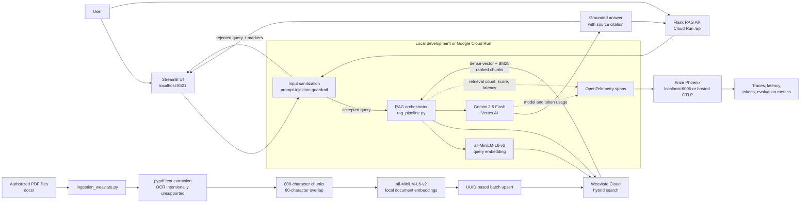

# Cloud Monitored RAG

Cloud Monitored RAG is a guarded, observable question-answering system for PDF knowledge bases. It combines local Hugging Face embeddings, Weaviate hybrid retrieval, Vertex AI Gemini generation, prompt-injection filtering, OpenTelemetry tracing, Arize Phoenix, and a Streamlit test console.

> **Current status:** The local RAG workflow has been tested end-to-end with Weaviate Cloud, local PDF ingestion, hybrid retrieval, Vertex AI generation, Phoenix traces, and Streamlit. Google Cloud Run deployment and public-repository publication are deployment steps that still need to be completed.

## Architecture



## Data flow

### Ingestion

1. Place authorized, text-based PDFs in `docs/`.
2. `ingestion_weaviate.py` extracts text with `pypdf`.
3. Text is normalized and split into 800-character chunks with 80-character overlap.
4. `sentence-transformers/all-MiniLM-L6-v2` creates 384-dimensional local embeddings.
5. Chunks, source filenames, chunk IDs, and vectors are upserted into the `KnowledgeChunk` Weaviate collection.
6. The collection uses Weaviate Cloud's supported HFresh vector index.

### Query and answer

1. The user submits a question through Streamlit or `POST /query`.
2. `sanitize_user_query` checks for known prompt-injection patterns and length violations.
3. Accepted queries are embedded locally.
4. Weaviate combines dense vector similarity and BM25 keyword matching with `hybrid()`.
5. Top-ranked chunks are passed as untrusted context to Gemini 2.5 Flash on Vertex AI.
6. The answer is returned with source references and a source-coverage safeguard.

### Observability

The pipeline emits OpenTelemetry spans for:

- `rag.run`
- `rag.retrieval`
- `rag.generation`

Span attributes include retrieval result count, retrieval hit rate, model name, and Vertex token usage when usage metadata is returned. Phoenix is available locally at `http://localhost:6006`.

## Repository components

| File | Purpose |
|---|---|
| `rag_pipeline.py` | Settings, guardrails, PDF extraction, chunking, Weaviate connection, hybrid search, generation, and evaluation signal |
| `ingestion_weaviate.py` | Command-line PDF ingestion and deterministic UUID upserts |
| `ingestion_service.py` | Optional Flask ingestion endpoint |
| `RAG_Agent_VertexAI_GoogleADK.py` | RAG orchestration and Google ADK-compatible agent factory |
| `RAG_Agent_VertexAI_GoogleADK.yaml` | Agent metadata and instructions |
| `Observability_Traces_Phoenix.py` | OpenTelemetry tracer and span helpers |
| `Server_Phoenix.py` | Local Phoenix server launcher |
| `streamlit_app.py` | Chat, retrieval inspector, guardrail, and telemetry UI |
| `api.py` | Flask `/health` and `/query` API |
| `Dockerfile` | Streamlit Cloud Run image |
| `Dockerfile.api` | Flask RAG API image |
| `Dockerfile.ingestion` | Ingestion service image |
| `cloudbuild.yaml` | Example Cloud Build deployment configuration |
| `.env.example` | Safe configuration template |

## Local setup

### Prerequisites

- Python 3.11 or 3.12
- Google Cloud CLI
- A Google Cloud project with billing enabled
- Vertex AI API enabled
- Weaviate Cloud cluster and API key

Create and activate a virtual environment:

```powershell
python -m venv .venv
.\.venv\Scripts\Activate.ps1
python -m pip install --upgrade pip
python -m pip install -r requirements.txt
```

Copy `.env.example` to `.env` and fill in the values:

```env
WEAVIATE_URL=https://your-cluster.weaviate.cloud
WEAVIATE_API_KEY=replace-me
GOOGLE_CLOUD_PROJECT=your-project-id
GOOGLE_CLOUD_LOCATION=us-central1
GOOGLE_GENAI_USE_VERTEXAI=TRUE
VERTEX_MODEL=gemini-2.5-flash
```

Authenticate Google Cloud for local Vertex AI calls:

```powershell
gcloud auth login
gcloud auth application-default login
gcloud config set project YOUR_PROJECT_ID
gcloud services enable aiplatform.googleapis.com
```

## Run locally

### 1. Ingest PDFs

```powershell
python ingestion_weaviate.py --docs-dir docs
```

Verify the collection and object count in the Weaviate Cloud console or with:

```powershell
python -c "from rag_pipeline import connect_weaviate, close_weaviate, get_settings; s=get_settings(); c=connect_weaviate(s); col=c.collections.get('KnowledgeChunk'); print(col.aggregate.over_all(total_count=True).total_count); close_weaviate(c)"
```

### 2. Start Phoenix

```powershell
python Server_Phoenix.py
```

Open <http://localhost:6006>. The launcher uses Phoenix's `serve` process because `px.launch_app()` timed out during Windows database migrations in the tested Phoenix version.

### 3. Run a direct RAG query

```powershell
$env:RAG_TEST_QUERY = "What does the employee handbook say about unemployment insurance?"
python RAG_Agent_VertexAI_GoogleADK.py
```

### 4. Start Streamlit

```powershell
python -m streamlit run streamlit_app.py
```

Open <http://localhost:8501>.

### 5. Test the API

```powershell
python api.py
```

```powershell
$body = @{ prompt = "What does the employee handbook say about unemployment insurance?" } | ConvertTo-Json
Invoke-RestMethod http://localhost:8080/query -Method Post -ContentType "application/json" -Body $body
```

Prompt-injection queries should return HTTP `422`.

## Security controls

- `.env`, `.venv`, `docs/`, and `models/` are excluded from Git.
- Weaviate credentials are loaded from environment variables.
- Known prompt-injection markers are rejected before retrieval and generation.
- Retrieved document text is explicitly treated as untrusted data.
- The ingestion service should not be publicly exposed in production.
- Rotate any credential that has ever been exposed in a terminal, screenshot, or chat.
- Use Secret Manager for Cloud Run secrets rather than committing or hard-coding them.

## Evaluation evidence

The current online retrieval metric is `retrieval_hit_rate`, which measures the fraction of returned hits with a positive hybrid score and attaches the result to the `rag.run` span.

For a submission, run a small fixed evaluation set and record:

- Expected source retrieved in top-k
- Expected-term coverage
- Retrieval latency
- End-to-end answer latency
- Input/output/total token usage when Vertex returns it
- Phoenix trace screenshots with secrets excluded

Recommended evaluation questions include:

```text
What does the employee handbook say about unemployment insurance?
What should employees do after a workplace accident?
What benefits are available to eligible employees?
```

## Google Cloud deployment roadmap

The repository contains Cloud Run Dockerfiles, but deployment is intentionally separate from local validation.

1. Enable `run.googleapis.com`, `cloudbuild.googleapis.com`, `artifactregistry.googleapis.com`, and `aiplatform.googleapis.com`.
2. Store `WEAVIATE_API_KEY` in Secret Manager.
3. Build and deploy `Dockerfile.api` for the RAG API.
4. Build and deploy `Dockerfile` for Streamlit.
5. Upload source PDFs to Cloud Storage and protect the ingestion service.
6. Configure a hosted Phoenix or Arize Phoenix Cloud OTLP endpoint. A Cloud Run service cannot reach your laptop's `localhost:6006`.
7. Test `/health`, `/query`, guardrail rejection, and cloud traces.

Example API image build:

```powershell
gcloud builds submit --tag gcr.io/YOUR_PROJECT_ID/cloud-monitored-rag-api --file Dockerfile.api .
```

Do not pass production credentials as plain command-line environment values. Prefer Secret Manager references.

## Public repository checklist

Before pushing this repository:

- Rotate the exposed Weaviate API key.
- Confirm `.env` is not staged.
- Confirm `.venv/`, `docs/`, and `models/` are not staged.
- Review `git diff --cached` for secrets.
- Add evaluation screenshots without credentials or personal data.
- Add the Phoenix evidence and test results.

## License and document ownership

Only publish PDFs, screenshots, code, and evaluation data that you own or have permission to redistribute. The local handbook PDF is intentionally excluded from this repository.
